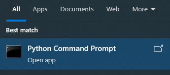
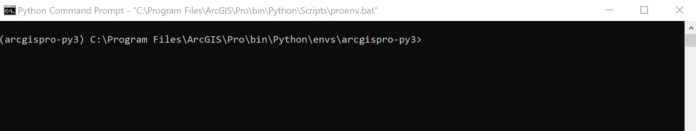
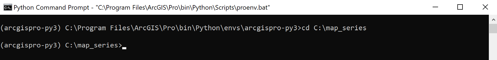
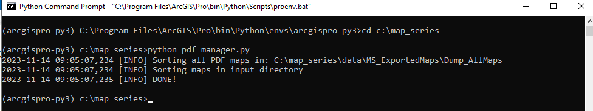

# Map Series

 The purpose of this repository is for development and testing various components of the map series proof of concept (PoC).
More documentation to be added as development progresses.

### Requirements

This project will require the installation of ArcGIS Pro as access to the default ArcGIS Pro python environment is 
required to run these scripts. Ensure that you have a valid licence before running the scripts.

### Usage

The components follow a standardized workflow and the instructions on how to use each tool will be relatively similar.
To operate a tool follow these instructions:
    
1. Select the appropriate .py file from the main folder of this repository and open it in the IDE of your choice 
(Notepad++ is a good alternative if no traditional IDE is available).
2. Alter the parameters referring to the descriptions within the .py file or in this document as needed.
3. If running the file from a traditional IDE run the file as normal. If one is not available to you see the directions
for running the file from the command line below.

   - Open the search window from the bottom left of your screen and search for 'Python Command Prompt'

     
   - Ensure that the python environment is the default arcgis pro python env. This is usually named something like 
   'arcgispro-py3' and should be seen in the brackets in the far left of the command prompt window as seen below.
   
     
   - Using the 'cd' command navigate to the main folder of this repository
   
     
   - Run the workflow if your choice using the following command format: python 'name of python file'.py This should
   trigger your desired workflow to start running. If an error is returned instead verify the prior steps and try again.

     

## Component 1: PDF Map Production and Post Processing

This component contain scripts designed to produce and manipulate pdf files of the maps produced by map series.

### APRX to PDF

This workflow takes a .aprx file containing a map series and exports the maps as individual pdf files following the 
approved naming convention: "FEDCount_PollType_MapType". If not following this naming convention the .aprx file will not
be processed. The script outputs pdf files with the following naming convention: "PollType_FedNum_InsetType/PageNum".
The main script for this workflow is called aprx_to_pdf.py and it takes the following parameters:

| Name      | Type    | Required | Description                                                                                                                                                                                                        |
|-----------|---------|----------|--------------------------------------------------------------------------------------------------------------------------------------------------------------------------------------------------------------------|
| aprx_path | String  | True     | This parameter is the path to the .aprx file that contains the maps to be exported.                                                                                                                                |
| out_dir   | String  | True     | This Parameter should link to the directory will take the exported maps. If maps of a matching name are present in the file then they will be overwritten by the new maps.                                         |
| as_image  | Boolean | True     | This optional parameter determines if the maps is exported as vector graphics or as an image. This isfor specific cases where the basemap does not render properly in the PDF. The default value of this is False. |
| dpi       | Integer | True     | This optional parameter sets the dpi of the output PDF which effects its resolution. The default value for this parameter is 300.                                                                                  |

### PDF Management

This workflow sorts and creates consolidated versions of the exported pdf maps produced by map series. This workflow can 
be accessed via the pdf_manager.py script which takes the following parameters:

| Name       | Type   | Required | Description                                                                                                                                                                                              |
|------------|--------|----------|----------------------------------------------------------------------------------------------------------------------------------------------------------------------------------------------------------|
| dump_dir   | string | True     | This is the path to the folder containing all the pdf files exported from map series. All pdfs in this folder must meet the required naming convention in order to be properly processed by this script. |
| sorted_dir | string | True     | This should be the path to the destination folder for the pdfs. It can either be empty or contain outputs from a previous run of this script.                                                            |

### PDF Consolidation

This workflow consolidates pdf files based on the approved map series folder structure and exports them into a zipfile
at the root of the directory that shares its FED Number.

This workflow takes the following parameters:

| Name          | Type           | Required | Description                                                                                                                                                     |
|---------------|----------------|----------|-----------------------------------------------------------------------------------------------------------------------------------------------------------------|
| in_dir        | string         | True     | Path to the directory that contains all pdfs to be consolidated. Must be organized into the approved file structure for the map series project.                 |
| feds_to_combo | array(integer) | False    | This optional parameter should be and array of FED numbers as integers. Only pdfs in folders with this name will be consolidated when this parameter is filled. |

## Component 2: Data Downloads and Updates

This component consists of script designed to download data and make it usable for ArcGIS Pro and Map Series. Scripts 
in this component may ingest internal or external datasets clean and prep them to a format best suited for the map 
series project.

### Update PlaceNames

This script downloads and preprocesses the NRCan place names dataset for use in map creation. Not in full working order but 
a skeleton for future development has been implemented in this repository as an example. 

| Name         | Type   | Required | Description                                                                                                     |
|--------------|--------|----------|-----------------------------------------------------------------------------------------------------------------|
| geo_name_url | string | True     | This parameter is the url to the online zipfile that is to be downloaded and processed.                         |
| output_gdb   | string | True     | The gdb  in which the output feature classes will be placed. Should be preexisting.                             |
| fed_num_fc   | String | True     | The full path to the feature class or shapefile that contains the FED data to be joined to the downloaded data. |

